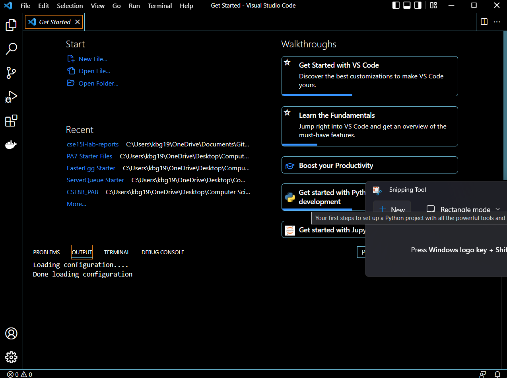
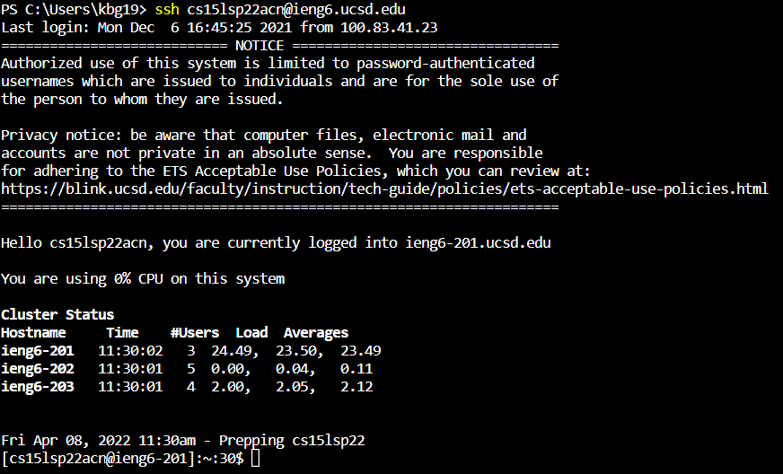
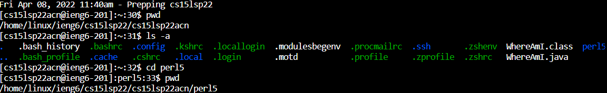
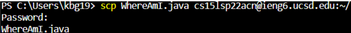
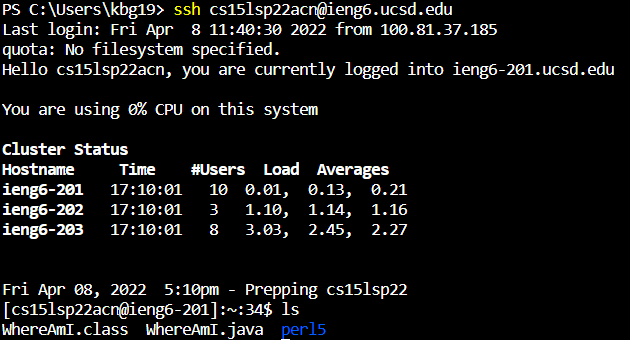
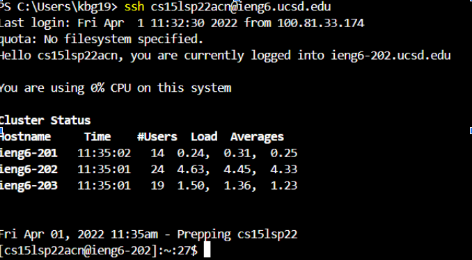
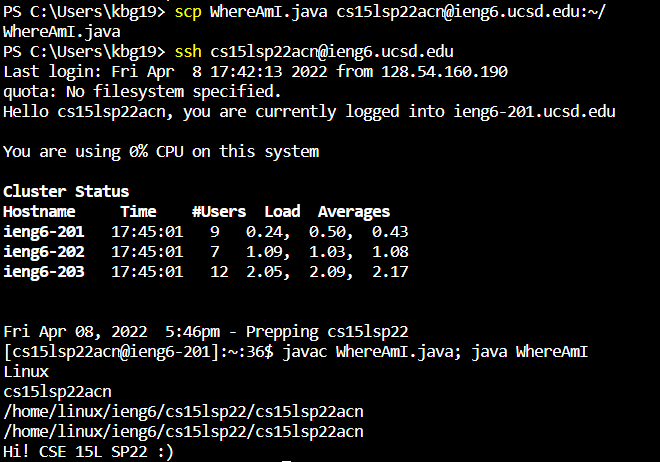

# Kameron's Lab Report 1
## Week 2, April 10, 2022
## ***Basics of Connecting to a Remote Server***

# **Step 1: Installing Visual Studio Code (VSCODE)**

First, [install Microsoft Visual Studio Code.](https://code.visualstudio.com/download)

Walkthrough the setup, and ensure the installation path is routed to a place that is convenient to you. When the installer completes and you open the application, you will be met with a screen that looks like this!

***

# **Step 2: Opening PowerShell and Remotely Connecting (SSH)**

With VSCode open, navigate to the Terminal at the bottom. You can access it by navigating to the bottom of the window and pulling up. A menu should appear.

Type in
    *ssh [your username]@ieng6.ucsd.edu*

ieng.ucsd.edu is merely the host name--the server you are trying to connect to. This may differ for you depending on the server you intend to connect to!

Hit **enter** on your keyboard.

After typing in your password, you should be able to connect to the server!

***

# **Step 3: Now, lets run some commands on the server computer.**

Now that we are connected to the server, lets interact with the external computer. The server I connected to is a UNIX-based system, so we will test out UNIX commands in this tutorial.

1. *pwd* - print working directory
This will print the entire directory/file path that you are currently in.

2. *ls -a* - list all files in current folder, including hidden ones.

3. cd [file name] - change directory
Navigate to a new file in your current directory.

**Let's see how they all work together!**

Notice how *pwd* tells us where we are, *ls -a* tells us everything in our location, and *cd perl15* puts us inside of that file.
After running *pwd* again, you can see that, indeed, our direction has changed.

# **Step 4: Using scp to copy files from local computer to host computer**

Open a new terminal on your LOCAL computer, and start a new sample file. In this case, mine is called "WhereAmI.java". In your case, this can be any file name/path.

*Note: if you are using a file name, ensure your current working directory has the file you wish to copy.*

Type this command: 
*scp [file name] cse15lsp22acn@ieng6.ucsd.edu*

In my case, the file name is "WhereAmI.java", so when you hit **enter**, you should see something that looks like this!

Now, repeat step 2, and try the command *ls*. Your file should be there!

***

# **Step 5: SSH Keygen and logging into a remote server without a password**

As you might have noticed, having to type in you password for EVERYTHING can get quite tedious. Luckily, there is still a way to bypass this password requirement while maintaining security: a unique key tied to your LOCAL machine that is also inside of the SERVER machine.

This is where ssh keygen, or key generation, comes in.

On your host computer (Windows), run this command:
    *ssh key-gen -t ed25519*

    For mac, the command is merely *ssh key-gen*

Hit **enter**.
You will then be asked the file you wish to save the password. 

Save it to this file path:
*\Users\<user-name>\.ssh\id_rsa*

Now, it will prompt you twice for a password. 
Hit **enter** EACH TIME. Do NOT set a password.

**Congrats!** You successfully created a key for your computer. Now it's time to put it on the server computer as well.

Now, log back into the server computer. Refer to **Step 2** for help.

Type the command
    *mkdir .ssh*
then log out.

On your LOCAL machine, recall the path used above for a command of this form: 
*scp /Users/<user-name>/.ssh/id_rsa.pub cs15lsp22zz@ieng6.ucsd.edu:~/.ssh/authorized_keys*

Now, when you log into the remote server, notice how you can bypass typing in the passcode! Logging in should now look like this:

***

# **Step 6: Optimizing server use**

**Congrats! You made it this far!**

Here's a *quick* example of how you can make using the server, well... *quicker*!

Recall the *WhereAmI.java* file from earlier.

Did you know that we can copy the file to the host computer and compile/run the program on the server computer all in 3 lines?

With these handy commands, I managed to do so:
1. *scp WhereAmI.java cs15lsp22acn@ieng6.ucsd.edu:~/*
2. *ssh cs15lsp22acn@ieng6.ucsd.edu* 
3. *javac WhereAmI.java; java WhereAmI*

following the format
*scp [file to copy] username@ieng6.ucsd.edu:~/*
*ssh username@ieng6.ucsd.edu* 
*[compile]; [run]*

After hitting enter, we see...

