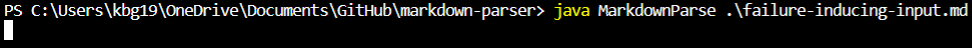
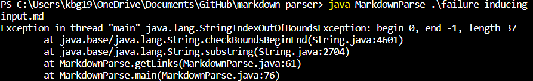

# Kameron's Lab Report 2
## Week 4, April 24, 2022
## ***Testing and Debugging***
*Group Members: Daniel Xu, Kameron Gano*

## Note
My group was fortunate enough to address all the issues we found in a single commit. We acknowledge that we could have benefited from a more iterative development process. Nevertheless, in this lab report, I will break down 3 bugs we addressed in our commit, as well as the symptoms they were inspired by.

# Background
In this lab, we were given buggy code for a program called [Markdown Parser](https://github.com/nidhidhamnani/markdown-parser/blob/main/MarkdownParse.java). Given the input of a markdown file, its aim was to parse out all the web links via a *getLinks()* method.

Here are 3 problems we discovered and addressed in our commit.

**LINK TO OUR COMMIT CAN BE FOUND [HERE](https://github.com/lithicarus/markdown-parser/commit/840dd64cdc91060ef80b9e68beace829c6d6861e)**

# Change #1: The Empty Link Problem
**Here is the change** 

The purpose of the above code was to ensure that the open and close parenthesis were not right next to each other, as this would indicate an empty link.

**Here is the [test file](https://github.com/lithicarus/markdown-parser/blob/main/testNoLink.md?plain=1) that exposed the bug**

In this case *symptom* was an infinite loop. The *bug* was that nothing incremented the index and iterated the while loop to reach the next line (the end). The *failure* was exposed by not including any text inside an otherwise properly declared link--the code was trying to parse a link that was not there. 

# Change #2: The Invalid Link Problem
**Here is the change** 

The purpose of the above code was to ensure that cases that improperly declared links would not be counted.

**Here is the [test file](https://github.com/lithicarus/markdown-parser/blob/main/testNoParantheses.md) that exposed the bug**

In this case *symptom* was an IndexOutOfBoundError. The *bug* was the the code was looking for an open parenthesis to parse the link; however, when indexOf() is unable to locate the index of a character, it returns -1, which is an index that does not exist. Our *failure* exposed this by not including the open paranthesis.

# Change #3: The Image Problem
**Here is the change** 

The purpose of the above code was to identify whenever a ! character was present before a link declaration indicating that it is an image and not a link.

**Here is the [test file](https://github.com/lithicarus/markdown-parser/blob/main/testImage.md?plain=1) that exposed the bug**

In this case *symptom* was that the program incorrectly identified the image as a valid link declaration. The *bug* was that there as noting checking to see if a "!" was present, so, all things being equal, it was able to find the brackets and parenthesis and parse the link. However, an image is not a link, so this is a *failure*. Though it did not break the code, it was not the expected output, so it failed our test.

