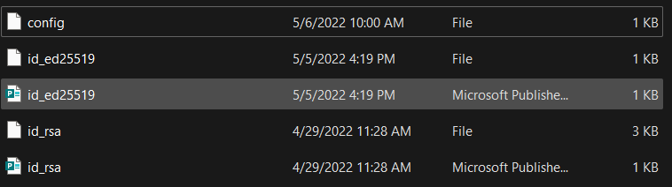

# Kameron's Lab Report 3
## Week 6, May 8, 2022
## ***Simplifying ssh***

# **Part 1: ssh config**

The ssh config file allows your computer to store the server you would like to connect to as an alias with a public key, so you are able to simplify connecting to the server even further.

Here is what mine looks like!

You'll notice I am directing it exactly to my id_rsa public key file, so I can continue to connext to the remote server without a password.
 
 You'll also notice that I call the host "ieng6". With all this in place, I can now ssh into the server like so:

 *ssh ieng6*

 Here is what it looks like:

 This now simplifies the copying process as well, as I only have to type *scp [ file_name ] ieng6 *. Here is what that looks like!

# **Part 2: github Access from server**
Now that we have simplified access to the server, now we can simplify github usage. The first thing I had to do was copy the details of my public keys into github, so that github could validate me (as a server user).

This is where my public key is stored: 

This matches the private key on my computer stored here (the contents are not shown for safety):

The last thing I had to do was set up a personal access token. I can not show a screen shot for safety reasons, but I followed the instructions in this [article](https://docs.github.com/en/enterprise-server@3.4/authentication/keeping-your-account-and-data-secure/creating-a-personal-access-token)

With this all set up, I was able to make a sample change to my cse15l-lab-reports repo like so: 

and run the following github commands, resulting in a successful push!

The link to the commit for proof of success can be found [here](https://github.com/kgano-ucsd/cse15l-lab-reports/commit/15b371757a04d5be345c91bdd55ebda7e5199411)

# **Part 3: Copying full repos with scp with EASE!**

With the command format *scp [server name] -r" whilst being in our markdown-parser folder, we can copy the whole directory to ieng6 with the ieng6 alias like so:

We can now run our JUnit tests to show that it works from inside ieng6 to show that it works properly!

Lastly, as a culminatation of our newfound ease/alias to log into the server, we can combine the copying, ssh-ing, and test-running process by separating scp and ssh with a semicolon. Then, immediatelly following the ssh command, put in quotes "" changing the directory to the proper file you are copying over, then the javac -cp... and java -cp... commands to run with JUnit. When we hit entire, we run the the whole line--copying, ssh-ing, and testing--all at once!

