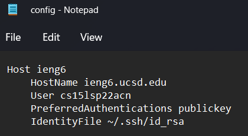

# Kameron's Lab Report 3
## Week 6, May 8, 2022
## ***Simplifying ssh***

# **Part 1: ssh config**

The ssh config file allows your computer to store the server you would like to connect to as an alias with a public key, so you are able to simplify connecting to the server even further.

Here is what mine looks like!

You'll notice I am directing it exactly to my id_rsa public key file, so I can continue to connext to the remote server without a password.
 
 You'll also notice that I call the host "ieng6". With all this in place, I can now ssh into the server like so:

 *ssh ieng6*

 Here is what it looks like:

 This now simplifies the copying process as well, as I only have to type *scp [ file_name ] ieng6 *. Here is what that looks like!

# **Part 2: github Access from server**
Now that we have simplified access to the server, now we can simplify github usage. The first thing I had to do was copy the details of my public keys into github, so that github could validate me (as a server user).

In order to do this, I first had to create an ssh key on the ieng6 server using the command:

*ssh-keygen -t ed25519 -C "your_email@example.com"* -- email was replaced with *kgano-ucsd@github.com*

I did this inside my .ssh directory, so I ended up with two files: id_ed25519 and id_ed25519.pub

This houses the information of my ssh keys. Now, I had to copy the contents to github and create a new ssh-key with the contents I copied.
This is where my ssh key is stored on github: 

Next, I had to adjust to privatize the permission of my ssh key on the ieng6 server, so I ran a command that did this:
*chmod 600 ~/.ssh/id_ed25519.pub*

Next, I ahad to activate the ssh agent and add the id_ed25519 (kgano-ucsd@github.com) identity to the list of acceptable keys with the following two commands:
1. *ssh-agent /bin/sh*

2. *ssh-add ~/.ssh/id_ed25519*

With my ssh key now fully set up on the remote server and matched with the key on github, I had to establish a url connection to the cse15l-lab-reports repo like so:
**Note: I was inside the cse15l-lab-reports repo on the server when I did this**
*git remote set-url origin git@github.com:kgano-ucsd/cse15l-lab-reports.git*

With this all set up, I was able to make a sample change to my cse15l-lab-reports repo like so:
 

and run the following github commands, resulting in a successful push without a password!

The link to the commit for proof of success can be found [here](https://github.com/kgano-ucsd/cse15l-lab-reports/commit/15b371757a04d5be345c91bdd55ebda7e5199411)

# **Part 3: Copying full repos with scp with EASE!**

With the command format *scp -r . [server_name]:repo__location"  we can copy the whole directory to ieng6 with the ieng6 alias like so:

We can now run our JUnit tests to show that it works from inside ieng6 to show that it works properly!

Lastly, as a culminatation of our newfound ease/alias to log into the server, we can combine the copying, ssh-ing, and test-running process by separating scp and ssh with a semicolon. Then, immediatelly following the ssh command, put in quotes "" changing the directory to the proper file you are copying over, then the javac -cp... and java -cp... commands to run with JUnit. When we hit entire, we run the the whole line--copying, ssh-ing, and testing--all at once!

