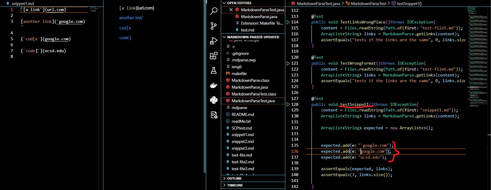
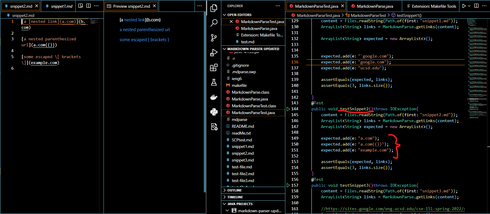
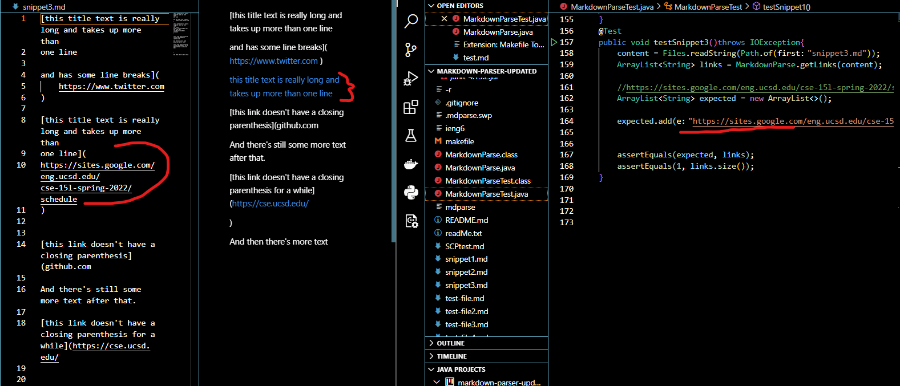
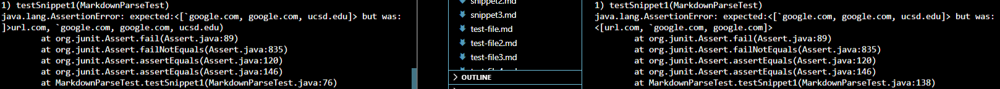
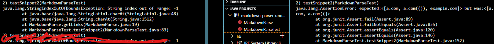
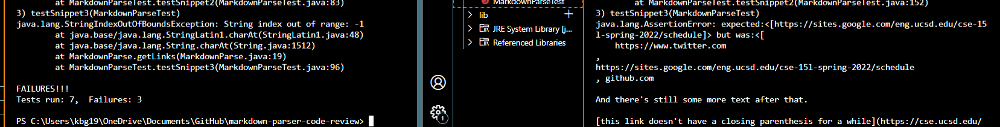

# Kameron's Lab Report 4
## Week 8, May 22, 2022
## ***Identifying and Addressing Issues***

# **Part 1: New tests, new expectations**

Last week, my group and I looked at another group's markdown-parser repository and was tasked with reviewing it. Our individual repositories can be found here:

Here is the link to [our group's repo](https://github.com/lithicarus/markdown-parser)

Here is the link to the [other group's repo](https://github.com/Hiro-229/markdown-parser.git)

This week, I was tasked with adding in new tests that make each repo fail, and then determining the best way to go about addressing any errors.

These were the code snippets, as well as the pertinent tests I wrote and expectations I have for each repo of markdown-parser:

## [Snippet 1](https://github.com/kgano-ucsd/markdown-parser/blob/main/snippet1.md)
Here is the test I wrote for snippet1 for each repo:

Based on the preview of snippet1.md, we see that the last 3 were recognized as valid link declarations, so we should expect a list of the links. The expected values are added to the "expected" array.

['google.com, google.com, ucsd.edu]. 

## [Snippet 2](https://github.com/kgano-ucsd/markdown-parser/blob/main/snippet2.md)

Here is the test I wrote for snippet2 for each repo:

Based on the preview of snippet2.md, we see that only the last 2 of the three links in the file were recognized as valid link declarations, so we should a list of the links. The expected values are added to the "expected" array.

[a.com, a.com(()), example.com]

## [Snippet 3](https://github.com/kgano-ucsd/markdown-parser/blob/main/snippet3.md)

Here is the test I wrote for snippet3 for each repo:

Based on the preview of snippet3.md, we see that only one link is recognized as a valid link declaration, so we should expect one link in the output. The expected values are added to the "expected" array.

[https://sites.google.com/eng.ucsd.edu/cse-15l-spring-2022/schedule 

# **Part 2: New failures, new solutions**

In this section, I will go over the results of these tests in each repo, and then outline the ways they can be addressed!

**PLEASE NOTE**: THE LEFT HALF OF EACH SCREENSHOT IS THE ***OTHER GROUP's*** REPO; THE RIGHT HALF IS ***OUR GROUPS*** REPO

## [Snippet 1](https://github.com/kgano-ucsd/markdown-parser/blob/main/snippet1.md) - **RESULTS**

Both repositories have a similar issue: neither check to see if another closeBracket is present after the first occurrence. There could be a for loop with an if statement nested inside of the check for a close bracket that sets the value of openBracket to the LAST OCCURRENCE of the character. In the case of the first link, the first character is " ` ", which invalidates the succeeding link declaration. 

The next issue is that the first link is improperly recognized. To address this, both repos would also need an if-statement that continues the loop if there is ANY character other than a space preceding the openBracket.

## [Snippet 2](https://github.com/kgano-ucsd/markdown-parser/blob/main/snippet2.md) - **RESULTS**

In the case of our repo, we have the same issue as above. We simply do not check to see if there is there is a closedBracket after the first occurence, so we would need a loop to iterate to the last occurence and set that to the value of the closedBracket. This is why we miss example.com.
We also miss the last parenthesis for the same reason, so it is important to iterate to the last occurrence of the closeBracket.

In the case of the other group's repo, the get an index out of bounds exception. This is indicative of a more drawn out issue, as they always check to see if the charAt(openBracket-1) is "!" (line 19). This often results in an index of "-1". This exception indicates that their code is fundamentally unequipped to handle edge cases such as these, and would need many more changes in order to figure out a stable implementation.

## [Snippet 3](https://github.com/kgano-ucsd/markdown-parser/blob/main/snippet3.md) - **RESULTS**

Our repo fails because we never check to see if a close bracket is on the next line. We would need to check to see that the text inside the open bracket does not contain a newline character, and if it does not, we know that the text simply continues on to the next line. In this case, we can get the closeBracket, and then, subsequently, the link.

Unfortunately, in this case of the other group's repo, it is hard to get an idea of the full scale of the issue, as they get the same index out of bounds error, implying that aa more involved change is necessary. Whenever an edge-case is thrown at it, it throws an exception, but its not exactly clear why it breaks in some scenarios and not others. Logically, their implementation is flawed, and needs a more robust algorithm--not one I can briefly explain.