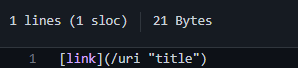
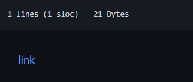
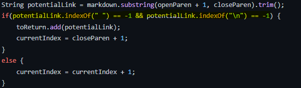
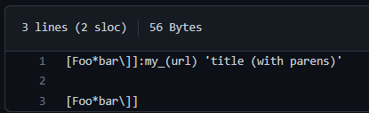
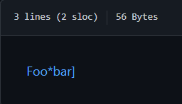
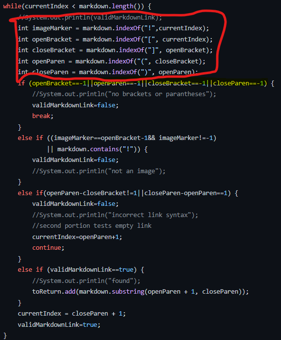

# Kameron's Lab Report 5
## Week 10, June 5, 2022
## ***Comparing Implementations of Markdown-Parser***

# **Introduction**

In lab 9, we compared a more complete implementation of Markdown-Parser with our own, and compared the outputs of over 600 tests (a provided bash script enabled us to do this). Even so, there were times where ours had the correct output and the other did not, vice-versa, or both implementations failed on a particular test.

My group and I did this by using the *vimdiff* method, which takes two files as arguments.

Prior to these steps, I cloned the sample repository from here: 
[This is the markdown-parser implementation we compared ours to](https://github.com/nidhidhamnani/markdown-parser)
1. I copied the tests files over with the following commands:
```
cp -r cse15lsp22-markdown-parser/test-files markdown-parser/
cp cse15lsp22-markdown-parser/script.sh markdown-parser/
cd markdown-parser
ls 
```
These commands brought the test-files and the shell script that runs them into our own markdown-parser directory

2. With all these present, we were able to run the bash script on each file with the command *make test* then piped the output to a unique file for each: my-markdown-parser-results.txt and other-markdown-parser.txt

3. From there, I could run 
```
vimdiff my-markdown-parser-results.txt other-markdown-parser.txt
```

After this, I was able to visually compare the differences between each output side by side, test by test like so:
(ours is on the left, the other is on the right)


Here is our results (on the left) and the other implementation's results (on the right):

{ width=150% }

Based on the on both the raw markdown text



and the markdown preview



We can see that the link in 481 is, in fact, defined properly and should produce an output of [/uri "title"] as ours does.



This is the code block in the other implementation that is not working. It is located inside the getLinks(String markdown) method, the method that is responsible for parsing a link out of each line.

In the highlighted condition of the if-statement, it checks if the index of a space and the endline character exists. If it does, it adds it to the return array. Otherwise, it skips over this particular link by incrementing the count.

The problem here is in the case of one-line markdown links, where there is no newline character anywhere in the file. test 481 is a file of this kind, with no new-line character to signify that this link is valid and should be added. Because this if-statement assumes a new-line character is needed, it will improperly skip the scenarios where a new-line character is not present, i.e. test 481. This is why it skips this link, even though it is properly defined.

# **Discrepancy 2: Test 194**

[Link to the test file 194](https://github.com/nidhidhamnani/markdown-parser/blob/main/test-files/194.md)


Here is our results (on the left) and the other implementation's results (on the right):

{ width=150% }

Based on the on both the raw markdown text



and the markdown preview



based on [this link](https://arcticicestudio.github.io/styleguide-markdown/rules/links.html#prefer-reference-links), it is clear that the brackets followed by a colon and link is also a valid link declaration. 

Thus, we should expect to see [my_(url)] in this case.

Neither implementation accounts for this case special case, but here I will focus on our implementation, as we return a wholly improper output in the form of an empty array.



Here, you'll see that we do not check if 
1. A colon exists
2. The colon is present after the first bracket
3. We get everything after the colon until the first space

Because of this, we automatically assume anything other than an open paranthesis directely after the close bracket invalidates the link. Instead, we need to to add an 
```
int colon = markdown.indexOf(":", closeBracket);
```
At the beginning, and add an additional check after the highlighted if statement where we see if the colon exists in the way described, and that we get everything after the colon until the first space. Because we do not do this, we automatically skip every link defined with a colon instead of open parenthesis.

